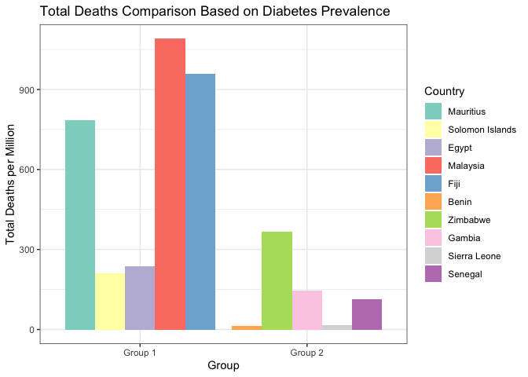

# Purpose

This shows the code and some of my thinking about what I intended to
show in my graphs and tables for each question.

``` r
rm(list = ls()) # Clean your environment:
gc() # garbage collection - It can be useful to call gc after a large object has been removed, as this may prompt R to return memory to the operating system.
```

    ##          used (Mb) gc trigger (Mb) limit (Mb) max used (Mb)
    ## Ncells 465970 24.9     996682 53.3         NA   669320 35.8
    ## Vcells 868412  6.7    8388608 64.0      16384  1840000 14.1

``` r
library(tidyverse)
```

    ## ── Attaching core tidyverse packages ──────────────────────── tidyverse 2.0.0 ──
    ## ✔ dplyr     1.1.2     ✔ readr     2.1.4
    ## ✔ forcats   1.0.0     ✔ stringr   1.5.0
    ## ✔ ggplot2   3.4.2     ✔ tibble    3.2.1
    ## ✔ lubridate 1.9.2     ✔ tidyr     1.3.0
    ## ✔ purrr     1.0.1     
    ## ── Conflicts ────────────────────────────────────────── tidyverse_conflicts() ──
    ## ✖ dplyr::filter() masks stats::filter()
    ## ✖ dplyr::lag()    masks stats::lag()
    ## ℹ Use the conflicted package (<http://conflicted.r-lib.org/>) to force all conflicts to become errors

``` r
library(RColorBrewer)
library(lubridate)
library(huxtable)
```

    ## 
    ## Attaching package: 'huxtable'
    ## 
    ## The following object is masked from 'package:dplyr':
    ## 
    ##     add_rownames
    ## 
    ## The following object is masked from 'package:ggplot2':
    ## 
    ##     theme_grey

``` r
library(knitr)
library(kableExtra)
```

    ## 
    ## Attaching package: 'kableExtra'
    ## 
    ## The following object is masked from 'package:huxtable':
    ## 
    ##     add_footnote
    ## 
    ## The following object is masked from 'package:dplyr':
    ## 
    ##     group_rows

``` r
list.files('/Users/gracegrant/Documents/Postgrad/Masters/Data Science/Take home exam/Question 1/code', full.names = T, recursive = T) %>% .[grepl('.R', .)] %>% as.list() %>% walk(~source(.))
list.files('/Users/gracegrant/Documents/Postgrad/Masters/Data Science/Take home exam/Question 2/code', full.names = T, recursive = T) %>% .[grepl('.R', .)] %>% as.list() %>% walk(~source(.))
list.files('/Users/gracegrant/Documents/Postgrad/Masters/Data Science/Take home exam/Question 3/code', full.names = T, recursive = T) %>% .[grepl('.R', .)] %>% as.list() %>% walk(~source(.))
list.files('/Users/gracegrant/Documents/Postgrad/Masters/Data Science/Take home exam/Question 4/code', full.names = T, recursive = T) %>% .[grepl('.R', .)] %>% as.list() %>% walk(~source(.))
list.files('/Users/gracegrant/Documents/Postgrad/Masters/Data Science/Take home exam/Question 5/code', full.names = T, recursive = T) %>% .[grepl('.R', .)] %>% as.list() %>% walk(~source(.))
covid_data <- read.csv("/Users/gracegrant/Documents/Postgrad/Masters/Data Science/Take home exam/Question 1/data/Covid/owid-covid-data.csv")
deaths_by_cause <- read.csv("/Users/gracegrant/Documents/Postgrad/Masters/Data Science/Take home exam/Question 1/data/Covid/Deaths_by_cause.csv")
description <- read.csv("/Users/gracegrant/Documents/Postgrad/Masters/Data Science/Take home exam/Question 1/data/Covid/covid_data_description.csv")
```

# Question 1: COVID

1.1 It might be interesting to look at deaths and the outbreak of the
pandemic compared to other regions.

``` r
covid_cleaned <- covid_data %>%
  filter(location %in% c("Africa", "Asia", "North America", "Oceania", "South America", "Europe")) %>% mutate(total_deaths = ifelse(is.na(total_deaths), 0, total_deaths))

covid_cleaned <- covid_cleaned %>% mutate(total_cases = ifelse(is.na(total_cases), 0, total_cases))

bar_deaths <- plot_deaths(covid_cleaned)
bar_deaths
```

<!-- -->

This first graph shows the total number of deaths for each continent
from COVID.

``` r
library(lubridate)
library(dplyr)

suppressWarnings(line_cases <- plot_cases(covid_cleaned))
```

    ## `summarise()` has grouped output by 'month'. You can override using the
    ## `.groups` argument.

``` r
line_cases
```

<!-- -->

This graph shows how each continent experienced a growth in total cases
(in millions) in 2020.

For this next bit, I grouped the countries that had the highest and
lowest 1. percentage of population aged older than 70 2. extreme poverty
and 3. diabetes prevalence. I can then compare the total deaths for the
two graphs for each graph to see how e.g. having a higher prevalence of
diabetes affected COVID deaths.

``` r
age_plot <- grouped_age(covid_data)
age_plot
```

<!-- -->

``` r
poverty_plot <- grouped_poverty(covid_data)
poverty_plot
```

<!-- -->

``` r
factors <- covid_data %>% select(location, aged_70_older, extreme_poverty, diabetes_prevalence, total_deaths_per_million) %>% group_by(location) %>% filter(!is.na(extreme_poverty)) %>% filter(!is.na(aged_70_older)) %>% filter(!is.na(diabetes_prevalence)) %>% slice(n()) %>% arrange(desc(diabetes_prevalence))

diabetes_plot <- grouped_diabetes(covid_data)
diabetes_plot
```

<!-- -->

I want to look at weekly hopsital admissions and weekly ICU admissions
to see if this can show leading or lagging indicators.

``` r
admissions_plot <- admissions(covid_data)
admissions_plot
```

<!-- --> Question 2

``` r
london_weather <- read.csv("/Users/gracegrant/Documents/Postgrad/Masters/Data Science/Take home exam/Question 2/data/London/london_weather.csv")
UK_detailed <- read.csv("/Users/gracegrant/Documents/Postgrad/Masters/Data Science/Take home exam/Question 2/data/London/UKMonthly_Detailed.csv")
london_weather$date <-as.character(london_weather$date)


UK_detailed$DATE <- as.Date(paste0(UK_detailed$DATE, "-01"), format = "%Y-%m-%d")

london_2000 <- london_weather %>% filter(date > 19991231)
#this only includes London weather info from 2000
```

I want to see the sunshine and rainfall in London in December 2020.

``` r
sun_plot <- lollipop_sun(london_2000)
sun_plot
```

<!-- --> I’m using the
next graph to show the rainfall for every day of the month of December
in 2020.

``` r
rain_graph <- london_rain(london_weather)
rain_graph
```

<!-- -->

There’s a lot of data starting all the way from 1881 which I don’t think
is very necessary. The weather and climate has also changed a lot since
then. I’ll look at average temperature sice 1980 in the Midlands and
compare that to Cape Town’s average temperature (around 16 degrees).

``` r
UK_1980 <- UK_detailed %>% filter (DATE >= "1980-01-01")
temp_graph <- temp_bar(UK_1980)
temp_graph
```

<!-- --> Question 3

``` r
coldplay_data <- read.csv("/Users/gracegrant/Documents/Postgrad/Masters/Data Science/Take home exam/Question 3/data/Coldplay_vs_Metallica/Coldplay.csv")
metallica_data <- read.csv("/Users/gracegrant/Documents/Postgrad/Masters/Data Science/Take home exam/Question 3/data/Coldplay_vs_Metallica/metallica.csv")
spotify_data <- read.csv("/Users/gracegrant/Documents/Postgrad/Masters/Data Science/Take home exam/Question 3/data/Coldplay_vs_Metallica/Broader_Spotify_Info.csv")
```

I’m going to do a scatter plot to see the correlation between
danceability and popularity and then show a table of the top 10 songs
based on danceability.

``` r
correlation_cp <- cor(coldplay_data[, c("popularity", "danceability", "energy", "instrumentalness", "liveness", "loudness")])
correlation_cp
```

    ##                   popularity danceability      energy instrumentalness
    ## popularity        1.00000000   0.17993936 -0.03528211      -0.16136556
    ## danceability      0.17993936   1.00000000  0.01424795      -0.11213829
    ## energy           -0.03528211   0.01424795  1.00000000      -0.29287109
    ## instrumentalness -0.16136556  -0.11213829 -0.29287109       1.00000000
    ## liveness         -0.20196212  -0.28388173  0.35364937      -0.07738163
    ## loudness          0.10233745   0.13329895  0.75144870      -0.56475347
    ##                     liveness   loudness
    ## popularity       -0.20196212  0.1023374
    ## danceability     -0.28388173  0.1332990
    ## energy            0.35364937  0.7514487
    ## instrumentalness -0.07738163 -0.5647535
    ## liveness          1.00000000  0.1724615
    ## loudness          0.17246149  1.0000000

``` r
correlation_m <- cor(metallica_data[, c("popularity", "danceability", "energy", "instrumentalness", "liveness", "loudness")])
correlation_m
```

    ##                  popularity danceability     energy instrumentalness
    ## popularity        1.0000000   0.24344089  0.1280016      -0.34843171
    ## danceability      0.2434409   1.00000000 -0.2998876      -0.09280628
    ## energy            0.1280016  -0.29988759  1.0000000      -0.29257074
    ## instrumentalness -0.3484317  -0.09280628 -0.2925707       1.00000000
    ## liveness         -0.2756755  -0.45307691  0.2564428      -0.15701412
    ## loudness          0.4318633  -0.07162439  0.7189076      -0.48755436
    ##                     liveness    loudness
    ## popularity       -0.27567550  0.43186333
    ## danceability     -0.45307691 -0.07162439
    ## energy            0.25644279  0.71890762
    ## instrumentalness -0.15701412 -0.48755436
    ## liveness          1.00000000  0.04445889
    ## loudness          0.04445889  1.00000000

``` r
#correlations show that danceability had the highest positive relationship with popularity for Coldplay and the second highest for Metallica so I'm using that metric


scatter_cp <- scatter_coldplay(coldplay_data)
scatter_cp
```

<!-- -->

``` r
scatter_m <- scatter_metallica(metallica_data)
scatter_m
```

<!-- -->

``` r
top_10_danceability_songs <- spotify_data %>% select(c(name, artist, danceability)) %>% 
  arrange(desc(danceability)) %>%
  head(10)

ht <- as_huxtable(top_10_danceability_songs)
colnames(ht) <- c("Name", "Artist", "Danceability")
ht <- set_all_borders(ht, TRUE)
ht <- set_font_size(ht, 12)
ht
```

    ## Warning in knit_print.huxtable(x, ...): Unrecognized output format "gfm+tex". Using `to_screen` to print huxtables.
    ## Set options("huxtable.knitr_output_format") manually to "latex", "html", "rtf", "docx", "pptx", "md" or "screen".

           ┌─────────────────────────┬──────────────┬──────────────┐
           │ name                    │ artist       │ danceability │
           ├─────────────────────────┼──────────────┼──────────────┤
           │ Leave Me Now            │ Herbert      │        0.986 │
           ├─────────────────────────┼──────────────┼──────────────┤
           │ Go Girl                 │ Pitbull      │        0.985 │
           ├─────────────────────────┼──────────────┼──────────────┤
           │ Funky Cold Medina       │ Tone-Lōc     │        0.984 │
           ├─────────────────────────┼──────────────┼──────────────┤
           │ State of Shock          │ The Jacksons │        0.982 │
           ├─────────────────────────┼──────────────┼──────────────┤
           │ Teachers                │ Daft Punk    │        0.98  │
           ├─────────────────────────┼──────────────┼──────────────┤
           │ Give It To Me           │ Timbaland    │        0.975 │
           ├─────────────────────────┼──────────────┼──────────────┤
           │ Ice Ice Baby (Radio     │ Vanilla Ice  │        0.975 │
           │ Edit)                   │              │              │
           ├─────────────────────────┼──────────────┼──────────────┤
           │ Tape Song               │ The Kills    │        0.974 │
           ├─────────────────────────┼──────────────┼──────────────┤
           │ Heavy Machinery         │ Scuba        │        0.973 │
           ├─────────────────────────┼──────────────┼──────────────┤
           │ Long Shot Kick De       │ The Pioneers │        0.971 │
           │ Bucket                  │              │              │
           └─────────────────────────┴──────────────┴──────────────┘

Column names: Name, Artist, Danceability I need to filter to only show
studio recordings.

``` r
studio_coldplay <- coldplay_data %>% filter(!grepl("live|Live", name)) %>% filter(!grepl("live|Live", album_name))
studio_metallica <- metallica_data %>% filter(!grepl("live|Live", name)) %>% filter(!grepl("live|Live", album))
```

This shows the popularity of each album for each band, using first a bar
plot and then a box and whisker.

``` r
pop_g_cp <- popularity_coldplay(studio_coldplay)
pop_g_cp
```

<!-- -->

``` r
pop_g_m <- popularity_metallica(studio_metallica)
pop_g_m
```

<!-- -->

``` r
box_cp <- box_coldplay(studio_coldplay)
box_cp
```

<!-- -->

``` r
box_m <- box_metallica(studio_metallica)
box_m
```

<!-- -->

Question 4

``` r
titles_data <- read.csv("/Users/gracegrant/Documents/Postgrad/Masters/Data Science/Take home exam/Question 4/data/netflix/titles.csv")
credits_data <- read.csv("/Users/gracegrant/Documents/Postgrad/Masters/Data Science/Take home exam/Question 4/data/netflix/credits.csv")
merged_data <- merge(titles_data, credits_data, by = "id")
```

This creates a table of the top 10 movies and shows based on director.

``` r
directors <- merged_data %>% filter(role == "DIRECTOR") %>% filter(release_year > 1980) %>%
        select (c("title", "type", "imdb_score", "name")) %>% arrange(desc(imdb_score)) %>% slice(1:10)

ht_dir <- as_huxtable(directors)
colnames(ht_dir) <- c("Title", "Type", "IMDB Score", "Director")
ht_dir <- set_all_borders(ht_dir, TRUE)
ht_dir <- set_font_size(ht_dir, 10)
ht_dir
```

    ## Warning in knit_print.huxtable(x, ...): Unrecognized output format "gfm+tex". Using `to_screen` to print huxtables.
    ## Set options("huxtable.knitr_output_format") manually to "latex", "html", "rtf", "docx", "pptx", "md" or "screen".

          ┌──────────────────┬───────┬────────────┬──────────────────┐
          │ title            │ type  │ imdb_score │ name             │
          ├──────────────────┼───────┼────────────┼──────────────────┤
          │ Reply 1988       │ SHOW  │        9.2 │ Shin Won-ho      │
          ├──────────────────┼───────┼────────────┼──────────────────┤
          │ My Mister        │ SHOW  │        9.2 │ Kim Won-seok     │
          ├──────────────────┼───────┼────────────┼──────────────────┤
          │ The Last Dance   │ SHOW  │        9.1 │ Jason Hehir      │
          ├──────────────────┼───────┼────────────┼──────────────────┤
          │ C/o              │ MOVIE │        9   │ Venkatesh Maha   │
          │ Kancharapalem    │       │            │                  │
          ├──────────────────┼───────┼────────────┼──────────────────┤
          │ David            │ MOVIE │        9   │ Keith Scholey    │
          │ Attenborough: A  │       │            │                  │
          │ Life on Our      │       │            │                  │
          │ Planet           │       │            │                  │
          ├──────────────────┼───────┼────────────┼──────────────────┤
          │ David            │ MOVIE │        9   │ Jonathan Hughes  │
          │ Attenborough: A  │       │            │                  │
          │ Life on Our      │       │            │                  │
          │ Planet           │       │            │                  │
          ├──────────────────┼───────┼────────────┼──────────────────┤
          │ David            │ MOVIE │        9   │ Alastair         │
          │ Attenborough: A  │       │            │ Fothergill       │
          │ Life on Our      │       │            │                  │
          │ Planet           │       │            │                  │
          ├──────────────────┼───────┼────────────┼──────────────────┤
          │ Okupas           │ SHOW  │        9   │ Bruno Stagnaro   │
          ├──────────────────┼───────┼────────────┼──────────────────┤
          │ Hunter x Hunter  │ SHOW  │        9   │ Hiroshi Koujina  │
          ├──────────────────┼───────┼────────────┼──────────────────┤
          │ Forrest Gump     │ MOVIE │        8.8 │ Robert Zemeckis  │
          └──────────────────┴───────┴────────────┴──────────────────┘

Column names: Title, Type, IMDB Score, Director I’m using the next graph
to see, firstly, what the top 10 highest rated movies and TV shows are
and then what their genres are.

``` r
shows <- titles_data %>% filter(type == "SHOW") %>% arrange(desc(imdb_score)) %>% filter(title != '#ABtalks') %>% slice(1:10)
movies <- titles_data %>% filter(type == "MOVIE") %>% arrange(desc(imdb_score)) %>% slice(1:10)

genre_tv <- genre_bar_tv(titles_data)
genre_tv
```

<!-- -->

``` r
genre_movies <- genre_bar_movies(titles_data)
genre_movies
```

<!-- --> I want to
see how the maximum IMDB score per year has changed over time.

``` r
score_plot <- line_score(merged_data)
```

    ## `summarise()` has grouped output by 'release_year'. You can override using the
    ## `.groups` argument.

``` r
score_plot
```

    ## `geom_smooth()` using method = 'gam' and formula = 'y ~ s(x, bs = "cs")'

<!-- --> Question 5

``` r
googleplay_data <- read.csv("/Users/gracegrant/Documents/Postgrad/Masters/Data Science/Take home exam/Question 5/data/googleplay/googleplaystore.csv")
reviews_data <- read.csv("/Users/gracegrant/Documents/Postgrad/Masters/Data Science/Take home exam/Question 5/data/googleplay/googleplaystore_user_reviews.csv")
merged_google <- merge(googleplay_data, reviews_data, by = "App")
```

I want to make a bubble chart of the different ratings of apps linked to
their size and then how many downloads they have which I’m assuming
links to profitability. I can also colour code by reviewer sentiment to
add more to the graph.

``` r
bubble_chart <- bubble(merged_google)
bubble_chart
```

<!-- --> I want to
see some of the characteristics of the different categories to determine
which type of app would be the best to develop.

``` r
filter_merged <- merged_google %>% filter(!grepl("varies|Varies", Size)) %>% na.omit() %>% filter(!grepl("NAN|Nan|NaN|nan", Sentiment))

    filter_merged$Installs <- as.numeric(gsub("[^0-9]", "", filter_merged$Installs))
    filter_merged$Size <- as.numeric(gsub("[^0-9]", "", filter_merged$Size))
    filter_merged$Installs <- filter_merged$Installs / 1000

categories <- filter_merged  %>% select(c("App", "Category", "Rating")) %>% unique() %>% arrange(desc(Rating)) %>% head(10)

ht_cat <- as_huxtable(categories)
colnames(ht_cat) <- c("Name", "Artist", "Danceability")
ht_cat <- set_all_borders(ht_cat, TRUE)
ht_cat <- set_font_size(ht_cat, 10)
ht_cat
```

    ## Warning in knit_print.huxtable(x, ...): Unrecognized output format "gfm+tex". Using `to_screen` to print huxtables.
    ## Set options("huxtable.knitr_output_format") manually to "latex", "html", "rtf", "docx", "pptx", "md" or "screen".

           ┌─────────────────────────┬────────────────────┬────────┐
           │ App                     │ Category           │ Rating │
           ├─────────────────────────┼────────────────────┼────────┤
           │ CDL Practice Test 2018  │ AUTO_AND_VEHICLES  │    4.9 │
           │ Edition                 │                    │        │
           ├─────────────────────────┼────────────────────┼────────┤
           │ DMV Permit Practice     │ AUTO_AND_VEHICLES  │    4.9 │
           │ Test 2018 Edition       │                    │        │
           ├─────────────────────────┼────────────────────┼────────┤
           │ Down Dog: Great Yoga    │ HEALTH_AND_FITNESS │    4.9 │
           │ Anywhere                │                    │        │
           ├─────────────────────────┼────────────────────┼────────┤
           │ Amino: Communities and  │ SOCIAL             │    4.8 │
           │ Chats                   │                    │        │
           ├─────────────────────────┼────────────────────┼────────┤
           │ Calculator with Percent │ TOOLS              │    4.8 │
           │ (Free)                  │                    │        │
           ├─────────────────────────┼────────────────────┼────────┤
           │ DU Recorder – Screen    │ VIDEO_PLAYERS      │    4.8 │
           │ Recorder, Video Editor, │                    │        │
           │ Live                    │                    │        │
           ├─────────────────────────┼────────────────────┼────────┤
           │ Even - organize your    │ FINANCE            │    4.8 │
           │ money, get paid early   │                    │        │
           ├─────────────────────────┼────────────────────┼────────┤
           │ Find a Way: Addictive   │ FAMILY             │    4.8 │
           │ Puzzle                  │                    │        │
           ├─────────────────────────┼────────────────────┼────────┤
           │ FreePrints – Free       │ PHOTOGRAPHY        │    4.8 │
           │ Photos Delivered        │                    │        │
           ├─────────────────────────┼────────────────────┼────────┤
           │ Fuzzy Seasons: Animal   │ FAMILY             │    4.8 │
           │ Forest                  │                    │        │
           └─────────────────────────┴────────────────────┴────────┘

Column names: Name, Artist, Danceability
